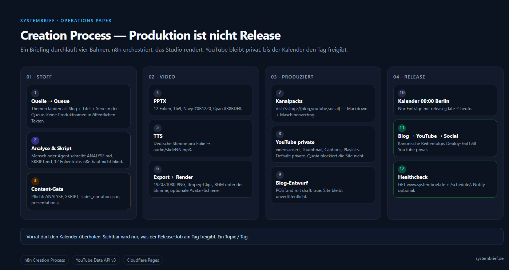
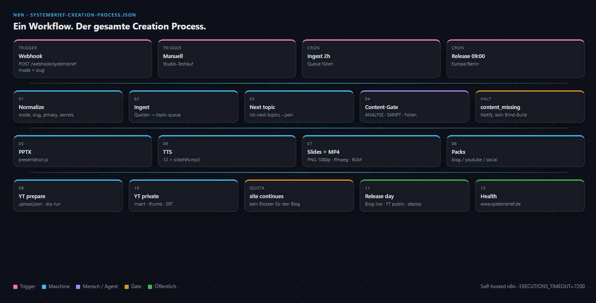
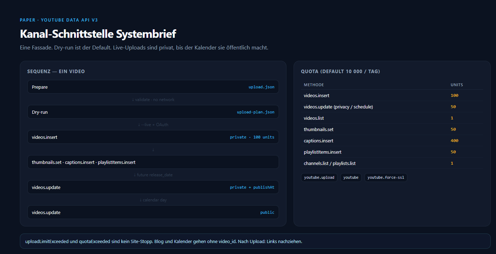
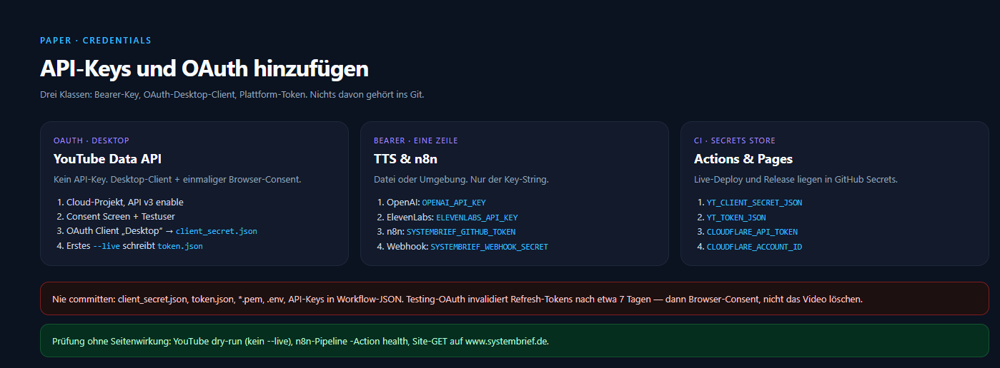
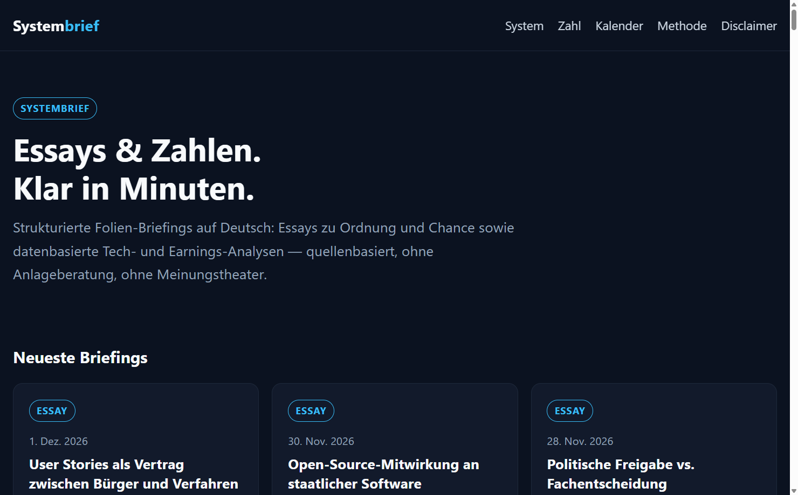
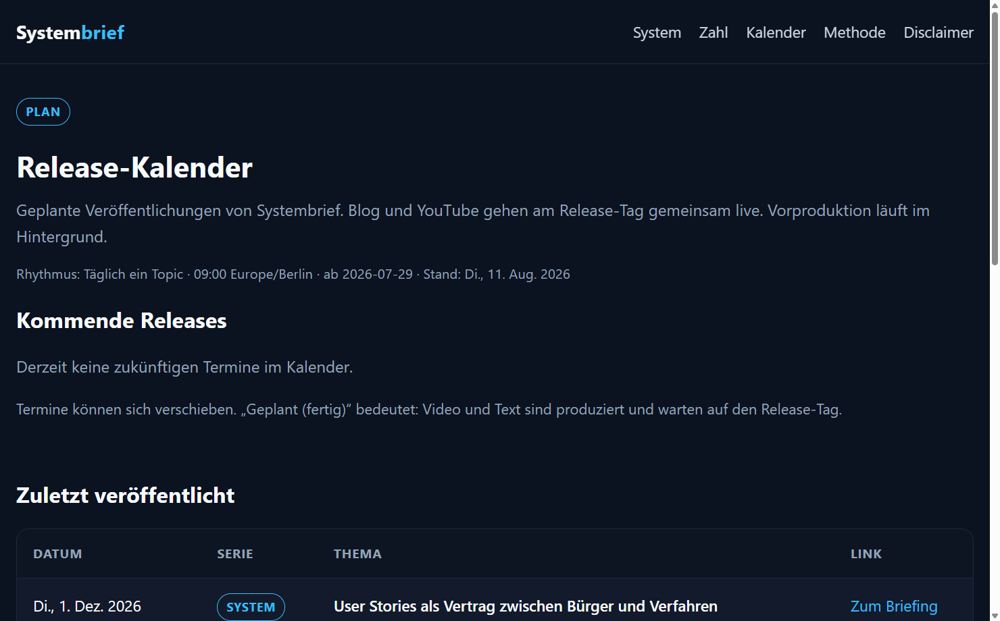

# Systembrief

Strukturierte deutsche Briefings zu Wirtschaft, Tech und den Regeln, die Wertschöpfung ermöglichen — oder ersticken.

**Essays & Zahlen. Klar in Minuten.**

[](LICENSE)
[](n8n/systembrief-creation-process.json)
[](papers/youtube-data-api.md)
[](https://www.systembrief.de)

| | |
|---|---|
| Blog | [www.systembrief.de](https://www.systembrief.de) |
| YouTube | [@systembrief_de](https://www.youtube.com/@systembrief_de) |
| Serien | **System** (Essays) · **Zahl** (Daten) |
| Schedule | [/schedule](https://www.systembrief.de/schedule/) |

Dieses Repository ist die **öffentliche Operations-Schicht**: der Creation Process als n8n-Graph, das YouTube-Interface als Paper, die API-Key-Anleitung. Renderer, OAuth-Dateien und unveröffentlichte Entwürfe bleiben im privaten Studio.

---

## Creation Process

Produktion, Website-Veröffentlichung und YouTube-Veröffentlichung sind getrennte Entscheidungen. Ein Briefing durchläuft vier Bahnen. n8n orchestriert; das Studio rendert. Bewusst veröffentlichte Website-Artikel bleiben online. Ein Produktionsentwurf ist kein Auftrag, einen bereits öffentlichen Artikel zurückzustufen. Die konfigurierte 09:00-Uhrzeit steuert den Release-Dispatch und den YouTube-Termin, nicht die dauerhafte Sichtbarkeit der Website.



| Bahn | Schritte | Sichtbarkeit |
|---|---|---|
| Stoff | Queue → Analyse/Skript → Content-Gate | intern |
| Video | PPTX → TTS → 1080p-MP4 | intern |
| Produziert | Packs + YouTube **private** + Blog-Entwurf | unsichtbar |
| Release-Dispatch | 09:00 Berlin, fälliger Queue-Eintrag | Website-Entscheidung separat · YouTube nach `publishAt` |

YouTube-Quota blockiert die Website nicht. Bereits öffentliche Website-Inhalte werden vom hier enthaltenen Workflow nicht zurückgestuft oder entfernt. Der Cloud-Workflow veröffentlicht selbst weder Blogartikel noch YouTube-Videos; der lokale Release-Runner ist in diesem Repository nicht enthalten.

Vollständig: [docs/creation-process.md](docs/creation-process.md)

---

## Ein n8n-Workflow

Der gesamte Prozess liegt in **einer** Datei:

[`n8n/systembrief-creation-process.json`](n8n/systembrief-creation-process.json)



```http
POST /webhook/systembrief
{ "mode": "full", "slug": "mein-thema", "privacy": "private" }
```

| `mode` | Tut |
|---|---|
| `status` | Queue + Health (sicherer Default) |
| `ingest` | Queue füllen |
| `produce` / `full` | Gate → Video → YouTube **private** |
| `release` | Fälligen Queue-Eintrag prüfen und Status aktualisieren; keine automatische Website- oder YouTube-Veröffentlichung im Cloud-Workflow |

Self-hosted n8n auf dem Studio für Build/Upload. n8n Cloud reicht für den Release-Dispatch.

Import und Env: [n8n/README.md](n8n/README.md)

---

## YouTube-Schnittstelle

Kein API-Key für Uploads. OAuth Desktop, eine Fassade, Dry-run als Default.



- Paper: [papers/youtube-data-api.md](papers/youtube-data-api.md)
- Scopes: `youtube.upload`, `youtube`, `youtube.force-ssl`
- Default: `videos.insert` → **private** · 100 Units
- Captions 400 Units · Thumbnails 50 · Schedule `private + publishAt`
- `invalidPublishAt` auf öffentlichen Videos · Testing-Refresh ~7 Tage

---

## API-Keys hinzufügen



Anleitung: [papers/credentials-and-api-keys.md](papers/credentials-and-api-keys.md)

Kurzform:

1. YouTube: Cloud-Projekt → API v3 → Desktop-Client → `client_secret.json` → erstes `--live` schreibt `token.json`
2. TTS: eine Zeile `OPENAI_API_KEY` / `ELEVENLABS_API_KEY`
3. n8n: `SYSTEMBRIEF_PIPELINE_ROOT` + optional PAT / Webhook-Secret
4. Actions: `YT_*`, `CLOUDFLARE_*` nur im Secret Store

Nie committen. Vorlage: [`.env.example`](.env.example)

---

## Live





---

## Repository

```text
n8n/systembrief-creation-process.json   gesamter Prozess
n8n/slices/                             optionale Teil-Workflows
papers/youtube-data-api.md              Kanalschnittstelle
papers/credentials-and-api-keys.md      Keys und OAuth
docs/creation-process.md                die zwölf Schritte
assets/visuals/                         Quellen der Diagramme
assets/screenshots/                     README-Figuren
```

---

## Mitmachen

Siehe [CONTRIBUTING.md](CONTRIBUTING.md) und [SECURITY.md](SECURITY.md).

## Lizenz

[MIT](LICENSE)
